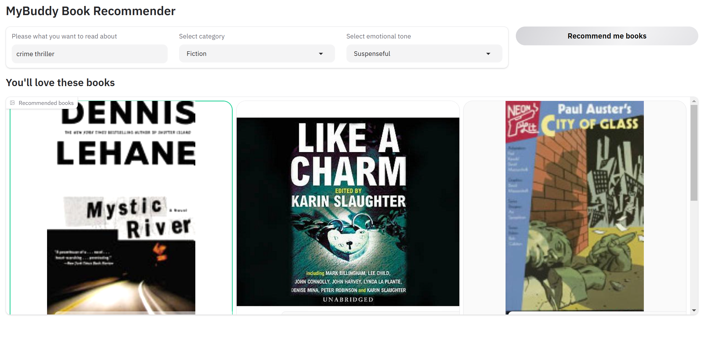

# book-recommendation-llm
This project uses OpenAI, Langchain and Gradio to build a book recommendation application using LLMs.
Steps taken:
1. Exploratory Data analysis and patterns of missing data.
2. Data Cleaning: Removing short descriptions, bucketing into broad categories of books: Fiction, Non-fiction, Childrens
3. Missing datapoint handling of categories.
4. Emotion detection from book descriptions
5. Create Chroma vectorstore for book description for semantic search.
6. Create Gradio UI which takes user input: book theme, category (fiction/ nonfiction etc), and emotional tone, and shows the book recommendations

Tools used:
1. Pandas and Seaborn
2. OpenAI embeddings and Chroma for storing and semantic search
3. Langchain DocumentLoader, and Textsplitter
4. Huggingface transformer: zero-shot classification and text classification.
5. Gradio for Recommender UI

### **Final Gradio UI**
 